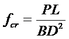
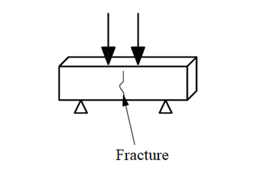
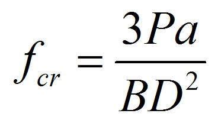
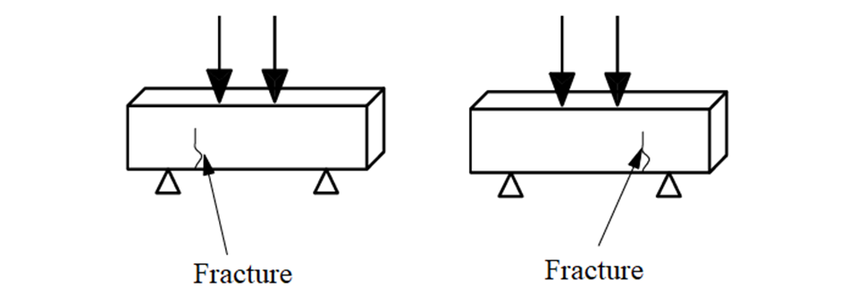

<h3> These steps will be followed for the experiment </h3>

<h5>Preparation of specimens:</h5>

<ol>
<li>Specimens when received dry shall be kept in water for 24 hour before they are taken for testing. Surface water and grit shall be wiped off the specimens and any projecting fins removed from the surfaces which are to be in contact with the packing strips. </li>
<li>The time between the extraction of the specimen from the curing tank until the test shall be as short as possible or not more than 2 h.</li>
</ol>

<h5>Measurement</h5>

1. The mass and dimensions of the specimen shall be noted before testing.

2. The dimensions of the specimen shall be taken to the nearest 0.2 mm positioning.

3. The bearing surfaces of the testing machine and of the loading strips shall be wiped clean before positioning the specimen.

4. The test specimen shall be placed in the loading setup. The span is taken as 600 mm for 150 mm specimens or 400 mm for 100 mm specimen.

<h5>Rate of Loading</h5>

1. The load shall increase at a rate 0.7 N/mm2 /min (rate of loading being 4 kN/min for 150 mm specimens and 1.8 kN/min for 100 mm specimens).

 

<h5>Failure load</h5>

1. The maximum load applied shall then be recorded. The appearance of concrete and any unusual features in the type of failure shall also be noted.

 

<h5>Assessment of type of fracture:</h5>

The fractured specimen shall be examined, and the appearance of the concrete and type of fracture shall be recorded. The modulus of rupture value is calculated based on the location of the observed fracture.
1. Type-A failure is when the fracture initiates in the tension surface within the middle third of the span (between the loading points). In this  ‘a’ is greater than 200 mm for 150 mm specimen, or greater than 133 mm for 100 mm specimen. In case of type A failure, modulus of rupture fcr is given by the following formula:

 

 

 

 

Figure. Type A failure

 
2. Type B failureis when the fracture initiates in the tension surface outside of the middle third of the span length by not approximately more than 5 percent of the span length. In case of type B failure, modulus of rupture fcr is given by the following formula:
 

 

where 'a' is the distance between the line of fracture and the nearer support, measured on the center line of the tensile side of the specimen. 'a' shall be less than 200 mm but greater than 170 mm for 150 mm specimen, or less than 133 mm but greater than 110 mm for a 100 mm specimen.
 

 

 

Figure. Type B failure/Unsatisfactory failure

 
3. Unsatisfactory failure is when the fracture initiates in the tension surface outside of the middle third of the span length by approximately more than 5 percent of the span length. When 'a' is less than 170 mm for a 150 mm specimen, or less than 110 mm fora 100 mm specimen, the results of the test shall be discarded.

<h5>Observations and Calculation:</h5>

 
The flexural strength shall be expressed to the nearest 0.05 MPa.

  
<table>
	<tr style="font-weight:bold; text-align:left">
		<td>
			No.
		</td>
		<td>
			Span length , L (mm)
		</td>
		<td>
			Depth, width, B, D (mm)
		</td>
		<td>
			Failure Load, P (N)
		</td>
		<td>
			Failure (Type A/B/unsatisfactory)
		</td>
		<td>
			Position of fracture, a (mm)
		</td>
		<td>
			Flexural Strength (N/mm2)
		</td>
	</tr>
	<tr>
		<td>
			1
		</td>
		<td>
		</td>
		<td>			
		</td>
		<td>			
		</td>
		<td>			
		</td>
		<td>			
		</td>
		<td>			
		</td>
	</tr>
	<tr>
		<td>
			2
		</td>
		<td>			
		</td>
		<td>			
		</td>
		<td>			
		</td>
		<td>			
		</td>
		<td>			
		</td>
		<td>			
		</td>
	</tr>
	<tr>
		<td>
			3
		</td>
		<td>			
		</td>
		<td>			
		</td>
		<td>			
		</td>
		<td>			
		</td>
		<td>			
		</td>
		<td>			
		</td>
	</tr>
	<tr>
		<td>
			Average:
		</td>
		<td>			
		</td>
		<td>			
		</td>
		<td>			
		</td>
		<td>			
		</td>
		<td>			
		</td>
		<td>			
		</td>
	</tr>
</table>

 

<h5>Precautions:</h5>
1. Verify that the samples do not have any significant defects that may affect the quality of the test results.
2. The sample should be placed in the machine such that form faces are on the top and bottom, that is, where these formed faces will contact the load and support points.
3. Ensure the prims is centered over the supporting span and perpendicular to the support.

